# MasterMaths

[This project](https://pvieira04.github.io/CI-project-1/) is now live on Github Pages. Deployment details below.

## [Contents](#contents)

* [User Experience (UX)](#user-experience-ux)
  * [Site Owner Goals](#site-owner-goals)
  * [New User Goals](#new-user-goals)
  * [Returning User Goals](#returning-user-goals)
  * [User Story - New Customer](#user-story---new-customer)
  * [User Story - Returning Customer](#user-story---returning-customer)
* [Planning](#planning)
  * [Strategy](#strategy)
  * [Scope](#scope)
  * [Structure](#structure)
  * [Skeleton](#skeleton)
  * [Surface](#surface)
  * [Review with Mentor](#review-with-mentor)
* [Technology](#technology)
  * [Languages](#languages)
* [Design](#design)
  * [Colour Scheme](#colour-scheme)
  * [Typography](#typography)
  * [Accessibility](#Accessibility)
  * [Imagery](#imagery)
  * [Wireframes](#wireframes)
* [Features](#features)
  * [Header and Navigation Bar](#header-and-navigation-bar)
  * [The Landing Page](#the-landing-page)
  * [The About Page](#the-about-page)
  * [The Contact Page](#the-contact-page)
  * [The Success Page](#the-success-page)
  * [The Resources Page](#the-resources-page)
  * [The 404 Page](#the-404-page)
  * [The Footer](#the-footer)
  * [Features Left to Implement](#features-left-to-implement)
* [Testing](#testing)
  * [Validator Testing](#validator-testing)
  * [Manual Testing](#manual-testing)
  * [User Testing](#user-testing)
  * [Browser Testing](#browser-testing)
  * [Device Testing](#device-testing)
  * [Lighthouse Report](#lighthouse-report)
  * [Unfixed Bugs](#unfixed-bugs)
* [Deployment](#deployment)
* [Credits](#credits)
  * [Content](#content)
  * [Media](#media)

## User Experience (UX)

MasterMaths is a site that exposes users to the existence of a mathematics home tutor in London, UK. The site will be targeted toward parents who wish to employ the services of a home tutor to help improve their child's mathematics. MasterMaths will be useful to parents because it will outline the tutor's unique method of teaching, show them how to go about employing the tutor's services, and provide information on where to find the best resources for studying.

### Site Owner Goals
- Convince parents of the tutor's expertise
- Encourage users to buy into the tutor’s method
- Funnel users towards the contact section to request a callback
- Get users on the phone to discuss pricing

### New User Goals
A first time user may want to :
- know price
- know whether tutor teaches online or at home
- know whether tutor can service them
- know how reporting works and having contact with the tutor
- know what the tutor looks like
- know about the tutor’s qualifications / experience
- know about previous students
- know how the tutor will teach their child

### Returning User Goals
Returning users may want to:
- find resources for their child
- remind themselves of the tutor's teaching method

### User Story - New Customer

- A new user will find out about the website, likely via a search engine. They will type in key words such as "maths", "tutor" and "London" and be given this website as one of the results. 
- The user will click on it and see the tutor's face and the tagline. They will become intrigued by the tagline and so they click on the call to action button, taking them to the about page. 
- As they land, they will see the educational quote from the philosopher Confucius, and they gain a sense of the tutor's teaching style. 
- They scroll down and find out about the process the student goes through under the tutor's care. They become convinced of the tutor's ability to teach their child. 
- They want to book a time with this person and secure a tutoring slot. They find the last section of the about page, and realise they live just outside the tutor's serviceable area.
- The user is a little worried but the message below the map comforts them in knowing they still have a chance of being taken on.
- They click on the button at the end of the about page and are taken to the contact page. They begin filling out the form with as much detail as they know and hit send. 
- They are then taken to the success page. The user sees that the message has been sent successfully and that there is a page dedicated to resources. 
- The user clicks on that resources link and scrolls down the page. However, the user is uninterested at this time and so closes the tab and waits for their callback.

### User Story - Returning Customer

- A returning user will navigate to my website for the purpose of finding extra resources for their child. 
- They know their child has trouble in remembering definitions in GCSE mathematics and so they will be happy to find that one of my recommended resources is Corbett Maths, a website that provices flashcards as one of their resources. 
- The user will read the tutor's description for Corbett Maths and be glad they found it. They will tap on the image and navigate to Corbett Maths.

## Planning
In this section, I outline the initial planning stages for this project.

### Strategy

The following is a list of potential features for the website and each one is given an importance and a viability rating. This is to decide on the most worthwhile features. Each one is also given a difficulty rating but this is investigated in the Scope Plane.

---
| **Opportunity / Problem** | **Importance** | **Viability / Feasibility** | **Difficulty** |
|-----------------------------|:-:|:-:|:-:|
| Showcase Personal Details   | 5 | 5 | 1 |
| Convince Users of Expertise | 5 | 5 | 2 |
| Links to Resources          | 3 | 5 | 1 |
| Testimonials                | 5 | 2 | 3 |
| Callback Form               | 5 | 5 | 2 |
| Callback Form Function      | 2 | 1 | 5 |
| Instructional Videos        | 3 | 4 | 3 |
| Map of Serviceable Areas    | 5 | 5 | 1 |
---

Resulting from the Strategy Plane, all features can go ahead with the exception of the callback form function. This feature requires other technologies aside from HTML and CSS and will therefore not be graded.

### Scope

Taking difficulty into account, my Minimum Viable Product(MVP) can be released without the need to consider a section for Testimonials and Instructional Videos.

The following features are my scope for this project:
- Landing Page which showcases the tutor's personal details
- About section which convinces users of the tutor's expertise
- Section which links to recommended resources
- Contact form
- Section telling the user which areas the tutor can travel to

### Structure

The website should take a new user on a journey, starting with a landing page and ending with contacting the tutor:

1. User arrives on website Landing Page.
2. User sees an enticing tagline, a call-to-action button, the tutor's photo and some basic information about them.
3. When the user scrolls down, the header stays at the top of the page and contains navigation links to connect the user to other parts of the page.
4. User can scroll down to the about section where they can see the tutor's story, how they became an expert and what their process is.
5. User can scroll down further and see a map of serviceable areas.
6. User can scroll further to the contact section and send a callback form.
7. User can then scroll to the end of the page where they can see the resources section and eventually the footer.

### Skeleton

[This was my original wireframe](./assets/media/wireframes/initial-wireframe.jpg). For some reason I had left out the resources section but that should have been inserted between the contact form and the footer.

### Surface

My idea for the surface is to have a consistent colour theme across all pages. Something like blue on white will give lots of contrast and depending on the blue colour used, is very appealing to my eyes.

For images, I know I want to have a photo of the tutor on the Landing Page and a map of serviceable areas. I also want to have screenshots of any resources I recommend. This will provide variety to the user so they stay engaged.

I want to use a different colour for elements I want the user to see first, or take special attention of.

As for the font, I know I want to have 2 complementing fonts. One for headers and emphasis, and another for general text.

Final design implementation can be found in the [design section](#design) of this README.

### Review with Mentor

Following a review of my planning with my mentor, I decided it was best to have multiple pages in my webstie. The revised structure of my project is outlined in the [wireframes section](#wireframes) of this README. The scope of the project was kept the same following the meeting.

## Technology

### Languages

- HTML5 - Latest version of HTML. Allows content to be placed on the website.
- CSS3 - Lastest version of CSS. Allows for custom styling of HTML elements.

## Design

### __Colour Scheme__
The initial color scheme was derived using the tool from the [coolors](https://coolors.co/) website.

The initial colours chosen were:
- #E2E2E2 (Platinum) - Used for the background colour for the website
- #5E9FFF (Cornflower blue) - Used as the colour for icons, the site logo and text emphasis.
- #EF6F6C (Light Coral) - Used as the background colour for call-to-action buttons.
- #A6BA78 (Olivine) - Used for the submit button on the contact form
- #565254 (Davy's gray) - Used as the color for partitions

According to accessibility guidelines (for users with colour blindness), the contrast ratio between foreground and background should be at least 7:1 for small text. Because of this, some of the colours needed to be changed.

The revised colour scheme is as follows:

- #E2E2E2 (Platinum) - Used for the background colour for the website
- #0000F4 (Blue) - Used as the colour for icons, the site logo and text emphasis.
- #EF6F6C (Light Coral) - Used as the background colour for call-to-action buttons.
- #A6BA78 (Olivine) - Used for the submit button on the contact form.
- #4A4547 (Davy's gray) - Used as the color for partitions and placeholder text.
- #000000 (Black) - Used for general text.

These are the results of the [contrast checker](https://webaim.org/resources/contrastchecker/):

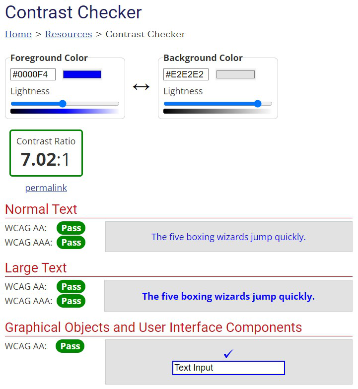

#### Other Checks on Used Combinations

[Black on Olivine Background](./assets/media/contrast/contrast-check-black-olivine.png)

[Black on Light Coral Background](./assets/media/contrast/contrast-check-black-coral.png)

[Davy's Gray on Platinum Background](./assets/media/contrast/contrast-check-gray-platinum.png)

### __Typography__

The fonts for this project were:

- Montserrat - Used for headings and button text.
- Noto Serif - Used for paragraph text and other non-header text.

Both fonts were obtained through Google Fonts.

The typography idea was taken from [this website](https://www.fontpairings.com/). I thought both fonts complemented each other well and were appropriate for this project.

### __Accessibility__

In order to adhere to accessibility guidelines for font size, the website is designed so that any font size does not go lower than 16px. Font sizes were changed in order to adhere to further accessibility guidelines. The body tag was given a font size rule of 100% and most other font size style rules were given a value in terms of em.

All external social media links in the footer open in a new tab and also warn the user this happens via an aria-label.

All images have alt text telling the user what the image is.

All external image links have appropriate alt text which can tell the user a new tab will open if clicked and say which website will be opened.

Any a tags that link to the current page have been deleted and replaced with p tags, apart from the website logo.

Text and background colour have a minimum of 7:1 contrast ratio to cater for all colour blindness.

All HTML and CSS is valid as shown in the validator testing seciton and across all HTML pages, there are no duplicate IDs.

Correct HTML markup is used throughout the project and content is in a logical order. Page elements also receive keyboard focus in a logical order and the HTML structure is the same on every page.

Every page had an appropriate title and the language of the page is specified.

img tags are used appropriately to show meaningful content while icons are coded in CSS.

The page is completely keyboard accessible and users can navigate through different pages of the website.

Regarding the contact formk, fields all have an associated label element which is correctly set up using the "for" attribute and the "id" attribute of all fields.

Labels on forms all have sufficiently descriptive text written exclusively for screen readers. Typical users will not know the label tag exists as it has been sent off the page.

If a user clicks on submit but a field has not been appropriately filled out, user is automatically directed to the problem field.

Form submissions are confirmed.

### __Imagery__

Imagery on this website was kept minimal. The only picture on the landing page is a photo of the tutor. The idea is for this to make the image stand out on the home page and be more memorable.

An image was also used for the about section to help users guage whether they lived in an appropriate area for the tutor to travel to.

Screenshots were taken of various websites for the resources section. This gives the user a short break from the monotonous black-on-platinum on the page and also allows for an area the user can click on to navigate to that site.

### __Wireframes__

  ### Landing Page Mockups
  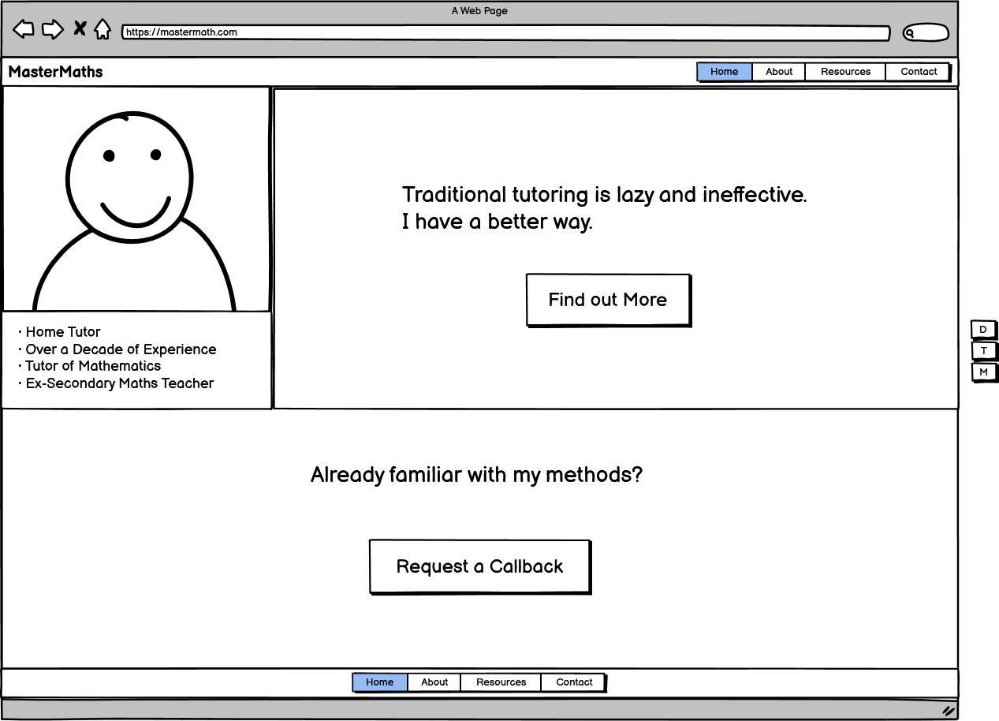

  [Landing Page Mockup - Tabelt Version](./assets/media/wireframes/landing-page-mockup-tablet.png)

  [Landing Page Mockup - Mobile Version](./assets/media/wireframes/landing-page-mockup-mobile.png)

  ### About Page Mockups
  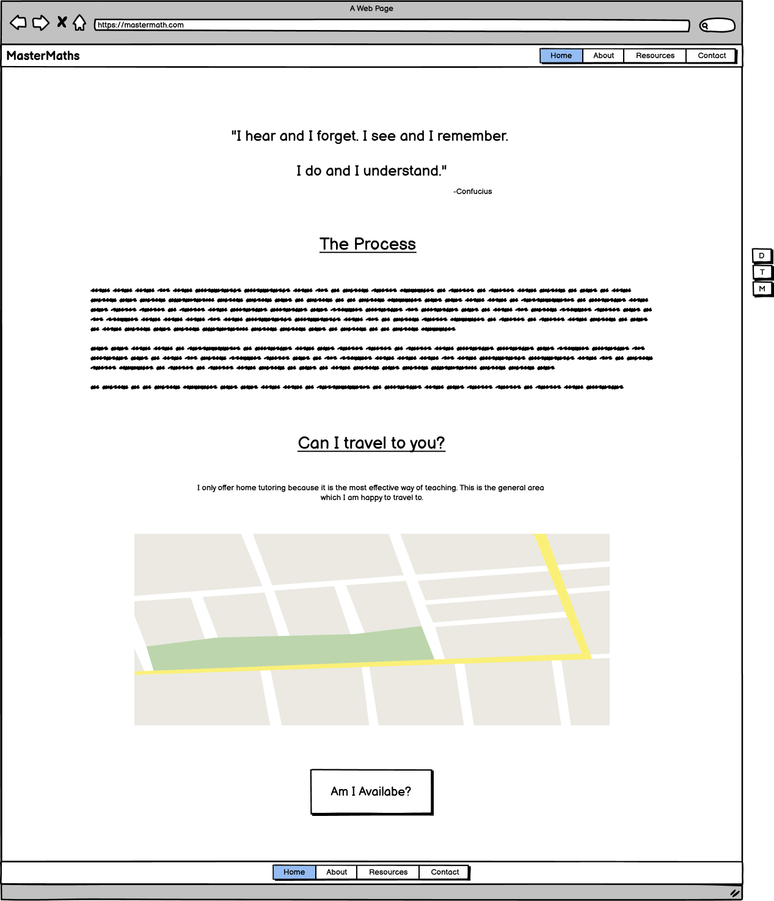

  [About Page Mockup - Tabelt Version](./assets/media/wireframes/about-page-mockup-tablet.png)

  [About Page Mockup - Mobile Version](./assets/media/wireframes/about-page-mockup-mobile.png)

  ### Contact Page Mockups

  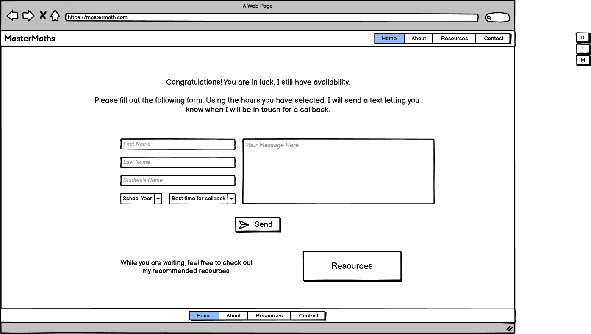

  [Contact Page Mockup - Tabelt Version](./assets/media/wireframes/contact-page-mockup-tablet.png)

  [Contact Page Mockup - Mobile Version](./assets/media/wireframes/contact-page-mockup-mobile.png)

  ### Resources Page Mockups

  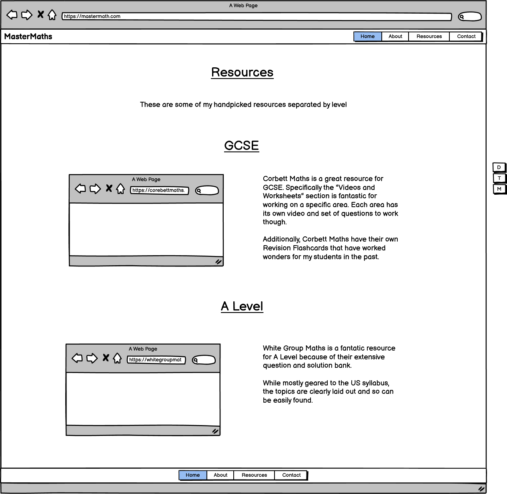

  [Resources Page Mockup - Tabelt Version](./assets/media/wireframes/resources-page-mockup-tablet.png)

  [Resources Page Mockup - Mobile Version](./assets/media/wireframes/resources-page-mockup-mobile.png)

## Features

### Header and Navigation Bar

  - Featured on all six pages, the fully responsive header and navigation bar includes links to the Home page, About page, Contact page and Resources page; and is identical in each page to allow for easy navigation.
  - This section will allow the user to easily navigate from page to page across all devices without having to revert back to the previous page via the ‘back’ button. 
  - On smaller screens, the navigation bar will change in layout to present the navigation links below the website logo.

### The Landing Page

  - The landing page includes three main sections.
  - The first section includes a photo of the tutor along with some basic information which together take up a third of the page's width on desktop, and a large tagline filling the rest of the page's width. Below the tagline, there is a call to action button.
  - Regarding the tagline, the word "better" is highlighted in blue in order to catch the user's attention and invoke a good feeling for the user, since "better" is a positive word.
  - The call to action button is pink which should catch the user's attention next, inviting them to navigate to the about section. 

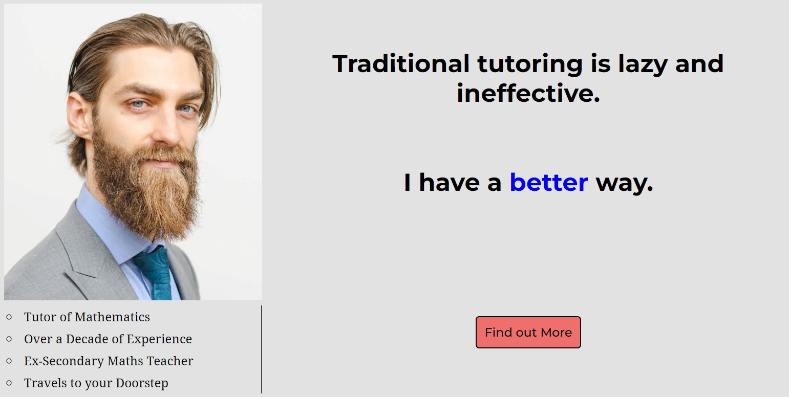

  - On devices like tablets which have smaller screens, the layout of this first section changes. Instead, the tagline is placed first, due to its importance, and then the tutor and their information is placed below.

[Landing Page - Section One - Tablet](./assets/media/features/landing-page-section-one-tablet.png)

  - On even smaller screens like mobile phones, the layout changes further. Below the tagline, the tutor's photo appears first and then the tutor's information.

[Landing Page - Section One - Mobile](./assets/media/features/landing-page-section-one-mobile.png)

  - Below the first section are two more sections which is dedicated to users that are already convinced by the tutor's teaching skills or are returning to the website seeking resources for their children. The layout of these two sections change minimally on smaller screens.

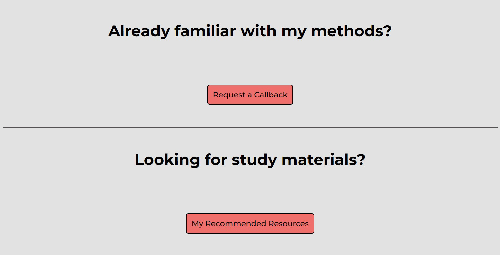

[Landing Page - Section Two and Three - Mobile](./assets/media/features/landing-page-section-two-three-mobile.png)

### The About Page

  - The about page is split into three sections.
  - The first section is a quote about education from the philosopher Confucius. The idea is to set the tone for the page and give the user an idea of the tutor's principles in teaching. For a parent who has yet to work with the tutor, this should provide some value to the user and entice them further into working with the tutor.
  - On smaller screens, the name "Confucius" appears in the middle of the screen for better readability.

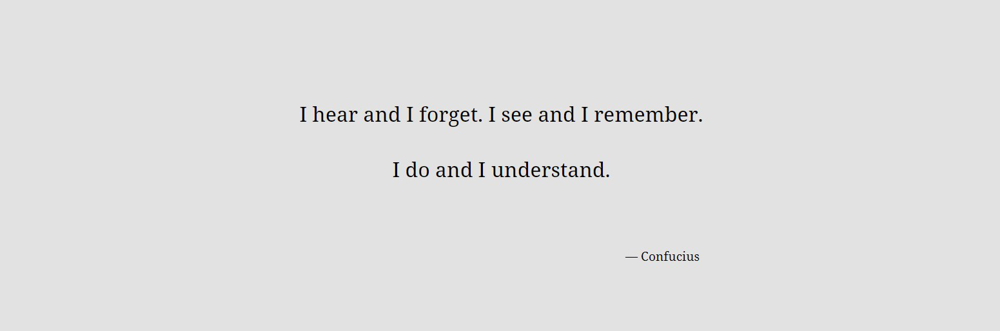
[About Page - Section One - Mobile](./assets/media/features/about-page-section-one-mobile.png)

  - The next section on the about page provides an outline of the tutor's story and details how the tutor will ensure the best outcome for their students. It can be difficult for a parent to trust someone else to teach their child and so this provides value in setting expectations regarding exactly what services the tutor does and does not provice. Parents who do not like the approach do not move forward, whereas parents who do will scroll further and attempt to book a callback.

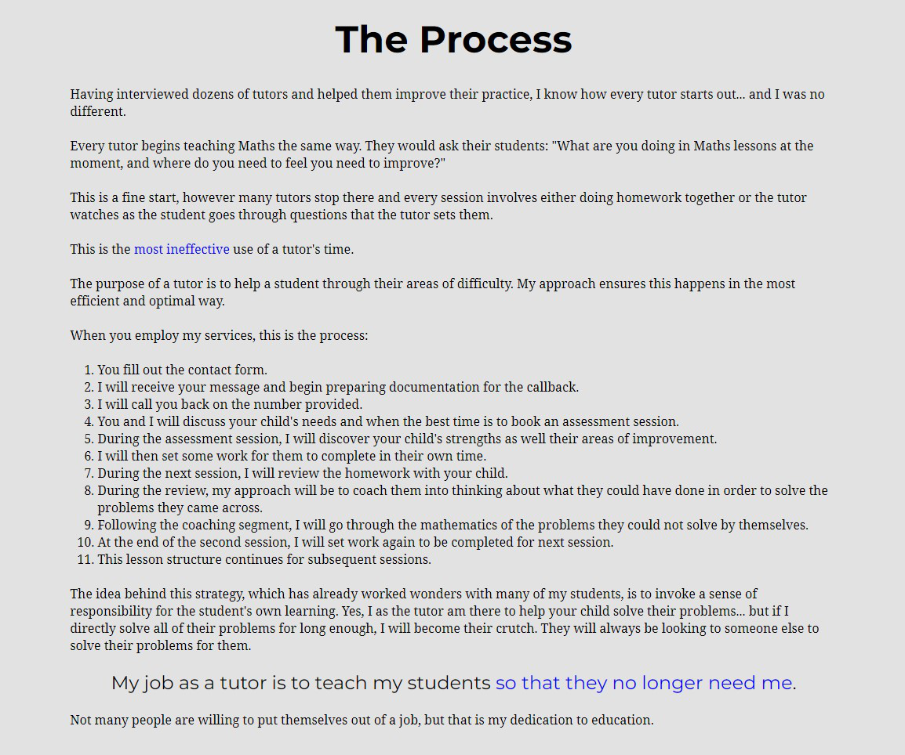

  - The last section allows the user to find out whether they live in an area appropriate for the tutor to travel to. This is a further filter so that the tutor can ensure they can work with the ideal client.
  - At the bottom of this section is a call to action button directing the user to the contact page. This is exactly where the user wants to go once they have been convinced of the tutor's expertise and professionalism.
  - This section is fully responsive but the layout does not change on smaller screens.

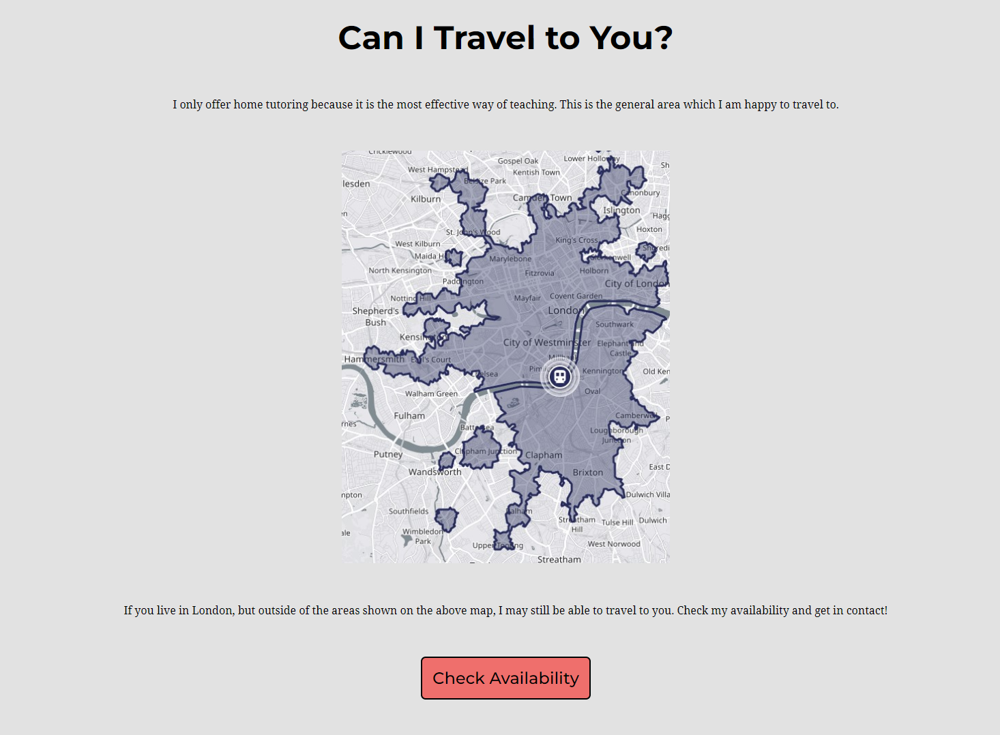

[About Page - Section Three - Mobile](./assets/media/features/about-page-section-three-mobile.png)

### The Contact Page

  - The contact page begins by congratulating the user in finding their way to the contact page while the tutor still has availability. This is to create a sense of scarcity; with the idea being that tomorrow, the tutor's schedule may be all filled out. 
  - The text below the congratulations message also reminds the user what the process is to securing a callback and promts the user to fill out the following form.
  - The form is split into two parts, left and right on desktop. The left hand side contains required fields asking for essential information the tutor needs to call the parent back, while the right side contains an optional textbox for the parent to write a custom message.
  - The form provides value to the parent because by this point they want this tutor to teach their child. Becasue of this, they would want to give as much information as necessary to the tutor so they can do their job to the best of their ability. Filling out the form gives the parent more confidence in the tutor's abilities.

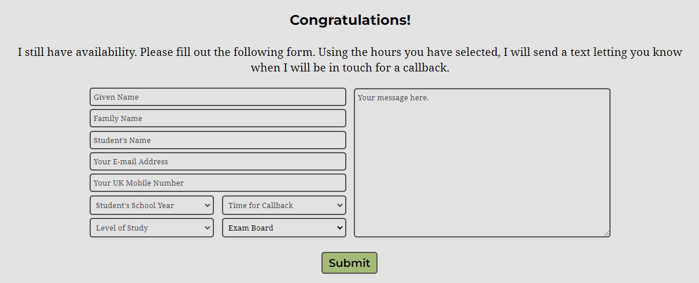

  - While being responsive, the form also chanages layout on smaller screens. The left side which asks for essential information is placed on top, while the textbox is placed beneath. This is to allow the user to still see the placeholder text on smaller screens so it is clear what they should write there.

[Contact Page - Mobile](./assets/media/features/contact-page-mobile.png)

### The Success Page

  - On submitting the contact form, the user will be directed to a page telling the user that their message has been sent successfully. This provides value to the user becasue a user may become anxious that something has gone awry if they are not provided a confirmation message; it comforts the user.
  - Following the success message, there is a call to action section allowing the user to be shown the way to the resources page. This provides further value to the user because some parents may want some extra work for their children to do while they wait to secure a tutoring session.
  - If the user does not wish to go to the resources section, they are also given the option to navigate to the landing page. This will allow the user to see the website tagline and tutor's basic information, and further reinforce their decision in selected this tutor.

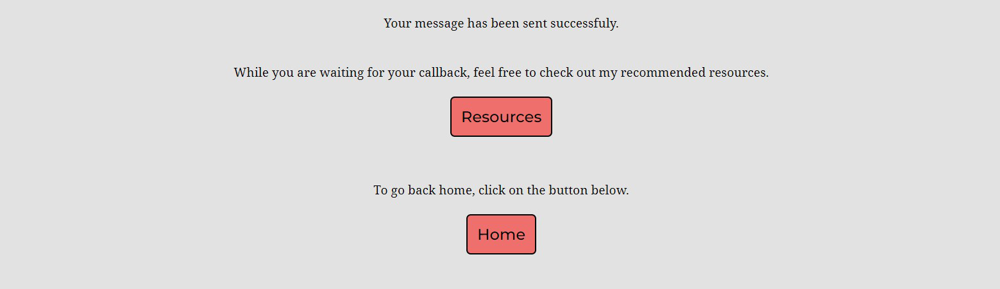

### The Resources Page

  - The Resources Page begins with a short introduction telling the user what this page is about.
  - The main section below the welcome message is split into two parts, GCSE and A-Level Maths.
  - Both parts are styled the same with a screenshot on the left hand side and on the right, a brief description of the website's resources and the tutor's recommendation in how to use it.
  - This provides great value to the user becasue there is a great variety in reasons to use each resource which can cater for a variety of needs.

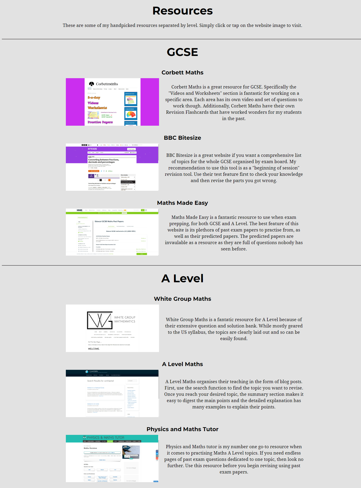

  - While being responsive, the resources page also changes layout on smaller screens. The screenshot image of the website is shown below the title of the resource, and the description is shown below. This is done to give better readability to the user.

[Resources Page - Mobile](./assets/media/features/resources-section-mobile.png)

### The 404 Page

  - This page will load for the user in the unlikely event that there are broken links on the website or if a user were to type in a nonexistent subdirectory into the web address box.
  - This provides value to the user by directing them to the landing page of the website so that they can achieve their goal for visiting.

### The Footer

  - The footer section includes links to the relevant social media sites for MasterMaths. The links will open to a new tab to allow easy navigation for the user.
  - The footer is valuable to the user as it encourages them to keep connected via social media.
  - The footer also includes an anchor allowing the user to quickly move to the top of the page. This is exceptionally valuable to the user if visiting the Resources or About page which can be quite long on mobile.

  - On smaller screens, the space between the items decreases but the layout does not change.

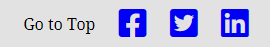

### Features Left to Implement

- On extremely small screens, it may be a better design for the website name be changed to a Logo just like the favicon on the left hand side, while the right hand side changes into a hamburger menu. Then the hamburger menu is tapped, the navigation menu is shown.

- An alternative layout for the header on extremely small screens may be for the website name to stay the same while the navigation links are replaced by a circle button; which, when tapped, will reveal a navigation menu which pushes the rest of the pages content down with a smooth scroll.

## Testing 

### Validator Testing 

- HTML
  - [index.html](index.html) - No errors were returned when passing through the official [W3C validator](https://validator.w3.org/nu/?doc=https%3A%2F%2Fpvieira04.github.io%2FCI-project-1%2F).
  - [about.html](about.html) - No errors were returned when passing through the official [W3C validator](https://validator.w3.org/nu/?doc=https%3A%2F%2Fpvieira04.githubio%2FCI-project-1%2Fabout.html).
  - [contact.html](contact.html) - No errors were returned when passing through the official [W3C validator](https://validator.w3.org/nu/?doc=https%3A%2F%2Fpvieira04.githubio%2FCI-project-1%2Fcontact.html).
  - [success.html](success.html) - No errors were returned when passing through the official [W3C validator](https://validator.w3.org/nu/?doc=https%3A%2F%2Fpvieira04.githubio%2FCI-project-1%2Fsuccess.html).
  - [resources.html](resources.html) - No errors were returned when passing through the official [W3C validator](https://validator.w3.org/nu/?doc=https%3A%2F%2Fpvieira04.githubio%2FCI-project-1%2Fresources.html).
  - [404.html](404.html) - No errors were returned when passing through the official [W3C validator](https://validator.w3.org/nu/?doc=https%3A%2F%2Fpvieira04.github.io%2FCI-project-1%2F404.html).

- CSS
  - No errors were found when passing through the official [(Jigsaw) validator](https://jigsaw.w3.org/css-validator/validator?uri=https%3A%2F%2Fpvieira04.github.io%2FCI-project-1%2F&profile=css3svg&usermedium=all&warning=1&vextwarning=&lang=en#css).

### Manual Testing

- Header and Navigation Bar
  - All links work as expected.
  - Navigation bar is responsive.
  - Header always appears at the top of the page.

- Landing Page
  - Fully responsive.
  - In desktop mode, the first section is responsive until the media queries trigger tablet mode.
  - In tablet mode, the right hand side reliably stays at the top, while the photo and tutor info is placed beneath.
  - Call to action button is responsive and works as expected.
  - Bottom two sections have responsive text and call to action buttons work as expected.

- About Page
  - Fully responsive.
  - The layout in desktop and mobile mode is the same.
  - The call to action at the bottom of the page works as intended.

- Contact Page
  - Fully responsive.
  - Has a maximum width and then responsively adjusts width until the madeia query for tablets triggers.
  - In tablet mode, the first part of the form is displayed on top and the textbox is displayed beneath.
  - The submit button works as intended. The user is only directed to the success page until all required fields have been adequately filled out.

- Success Page
  - Fully responsive.
  - The layout in desktop and mobile mode is the same.
  - Call-to-action buttons work as intended.

- Resources Page
  - Fully responsive.
  - Layout changes between desktop and mobile modes for the GCSE and A Level sections.
  - In Desktop mode, the images are on the left hand side while the description of the site is on the right.
  - In mobile mode, this changes so that the image appears above its description.

- 404 Page
  - Fully responsive.
  - Displayed error message always fits on the page.
  - Call-to-action button works as expected.

- Footer
  - Fully responsive.
  - Anchor tag works as expected.
  - Social Media links work as expected.
  - Layout stays the same between desktop and mobile mode.
  - On smaller screens, space between elements is reduced with no change to icon dimensions or text size.

### User Testing

I asked a real user to open my website on dektop. They used a mouse to navigate and this person has no accessibility requirements. This is how it went.

- User opens the MasterMaths website and reads the tagline.
- User then reads the tutor information section and scrolls down.
- User reads the heading for sections two and three of the Landing Page and then scrolls back up.
- They click on the about link in the navigation bar and read the quote.
- They laugh and nod their head.
- User scrolls down and reads about half of the about-process section.
- User scrolls down further to the about-travel section and comments on the map of serviceable areas - "Oh is that where you can travel to?"
- User clicks on the "Check Availability" call-to-action button.
- User sees the contact form and then navigates to resources via the navigation bar.
- They click on the image expecting it to open the website(they commented on it) and it opens in a new tab.
- The user closes the new tab and closes the MasterMaths tab.

### Browser Testing
Manual Testing was further done on other browsers. These browsers were chosen becasue, as found by [statcounter](https://gs.statcounter.com/browser-market-share), they are the most popular browsers in the world.

#### Desktop Browsers
- Chrome
- Edge
- Safari
- Firefox
- Opera

#### Tablet and Mobile Browsers

The tests for the following browsers can be found in the [device testing](#device-testing) section:

- Android (Tablet and Mobile)
- Chrome (Android)
- Safari (iOS)
- Samsung Internet (Android)

### Device Testing

While the device toolbar in Chrome Developer Tools was used throughout the development process, further manual tests were carried out on various physical devices visiting the [live website](https://pvieira04.github.io/CI-project-1).

- One Plus 6 - Chrome
  - No issues. Behaves as intended.
- Google Pixel - Chrome
- Galaxy Flip - Chrome
- Galaxy Flip - Samsung Internet
- 

### Lighthouse Report

#### Initial Report

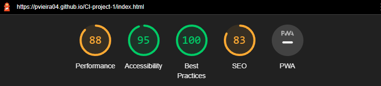

#### Actions

All actions were derived from addressing the opportunites outlined in the lighthouse report.

1. Added aria-label to external links in footer (Accessibility).
2. Converted image in index.html to webp format (Performance).
3. Added meta descriptions to all html pages (SEO).
4. Replaced Fontawesome CDN with manual installation of Fontawesome and deleted uneccessary styling rules (Performance).
5. Converted images in resouces.html to webp format and changed resolution appropriately (Performance).
   * Between the before and after shown below, the performance score stayed the same but the Cumulative Layout Shift changed by 0.004.
   * [Resources Mobile Before](./assets/media/lighthouse/lighthouse-report-resources-mobile-before.png)
   * [Resources Mobile After](./assets/media/lighthouse/lighthouse-report-resources-mobile-after.png)

#### Results

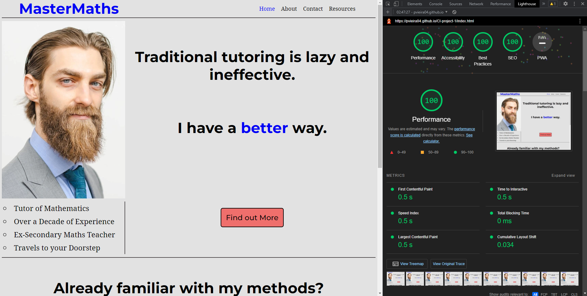

Under the Diagnostics section in the Lighthouse report, a warning was given to do with caching. The warning was called "Serve static assets with an efficient cache policy". After doing my research, it seems that since I am using Github Pages to deploy this project, I am unable to change the cache time which is [always set to 600 seconds](https://webapps.stackexchange.com/questions/119286/caching-assets-in-website-served-from-github-pages#comment143669_119294). Thus, this is one issue I am unable to address unless I change my deployment process.

Across all HTML pages, mobile rendering of the Lighthouse tool results in an equal or lower score for performance when compared to mobile.

Resulting Investigation:
- Cumulative Layout Shift(CLS) is either the same or higher on mobile when compared to desktop. This could affect the Performance score.
- The problem with this hypothesis is that the about page has an the same CLS value on mobile and desktop renders of the tool (0.042).
- Across desktop renders of all pages, the First Contentful Paint and Largest Contentful Paint are at 0.5 seconds, whereas mobile renders of all pages have a First Contentful Paint of 1.7 and a Largest Contentful Paint of 1.7 or higher.
- Unable to find a reason why mobile renders are slower across the board.

### Unfixed Bugs

No unfixed bugs.

## Deployment

The site was deployed to GitHub pages. The steps to deploy are as follows: 
  - In the GitHub repository, navigate to the Settings tab .
  - Under the "Code and automation" section, click on "Pages"
  - Under "Build and Deployment", select the option "Deploy from a branch" for "Source", and for "Branch", select "main".

[This is the live website](https://pvieira04.github.io/CI-project-1/)

## Credits 

### Content 

- The icons in the footer were taken from [Font Awesome](https://fontawesome.com/).
- The links in the head of my html files for the favicons were taken from [favicon.io](https://favicon.io/favicon-generator/).
- Thank you to [Deque Universtiy](https://dequeuniversity.com/rules/axe/4.4/link-name?utm_source=lighthouse&utm_medium=devtools) for helping me understand how to use the aria-label atribute for external links.
- Thank you to [this stack overflow thread](https://stackoverflow.com/questions/46163065/github-pages-website-favicon-not-showing) for helping me understand the problem with my favicons.
- Thank you to the [Love Running Example Project]() for helping with my README structure.
- Thank you to [Chrome Developers](https://developer.chrome.com/docs/lighthouse/seo/meta-description/?utm_source=lighthouse&utm_medium=devtools) for helping me understand how to insert meta descriptions in my html.
- Thank you to the [Sonnytech Academy YouTube channel](https://www.youtube.com/watch?v=fzxpb3bVGeE) for showing me how to add Font Awesome to my project offline.
- Thank you to [elsevier.com](https://www.elsevier.com/en-gb) for their [summary report](https://romeo.elsevier.com/accessibility_checklist/downloads/Summary_of_accessibility_requirements_21_Feb_2014.pdf) of accessibility guidelines. I applied their suggestions and implemented them in this project.
- Thank you to Gian Wild for their [article on sitepoint.com](https://www.sitepoint.com/15-rules-making-accessible-links/). Their accessibility suggestions were fascinating and I applied some of them in this project.

### Media

- The tutor photo used on the home page was an original photo that I have the rights to.
- The Map of Servicable Areas on the About Page was a screenshot taken from [app.traveltime.com](https://app.traveltime.com/).
- The images on the resources page were screenshots taken of the website they link to.
- The favicons were created using the online tool [favicon.io](https://favicon.io/favicon-generator/).
